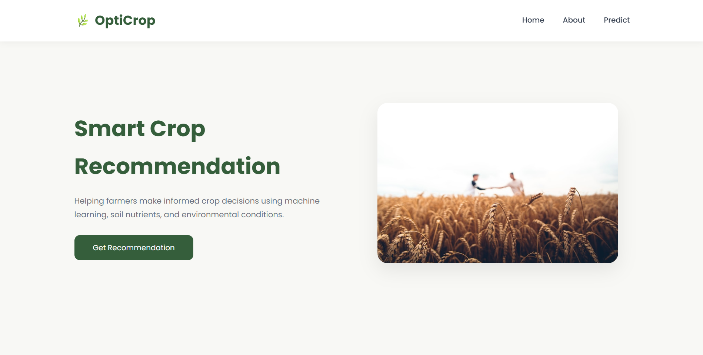
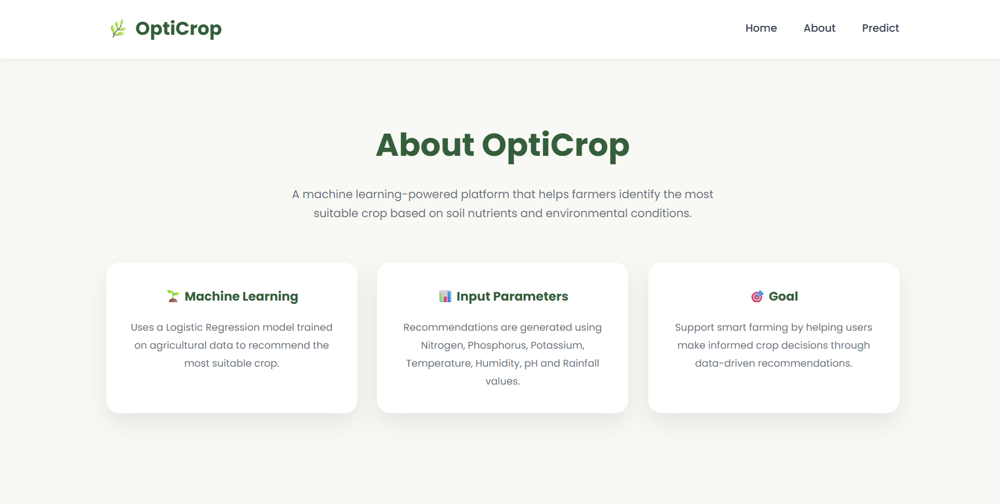
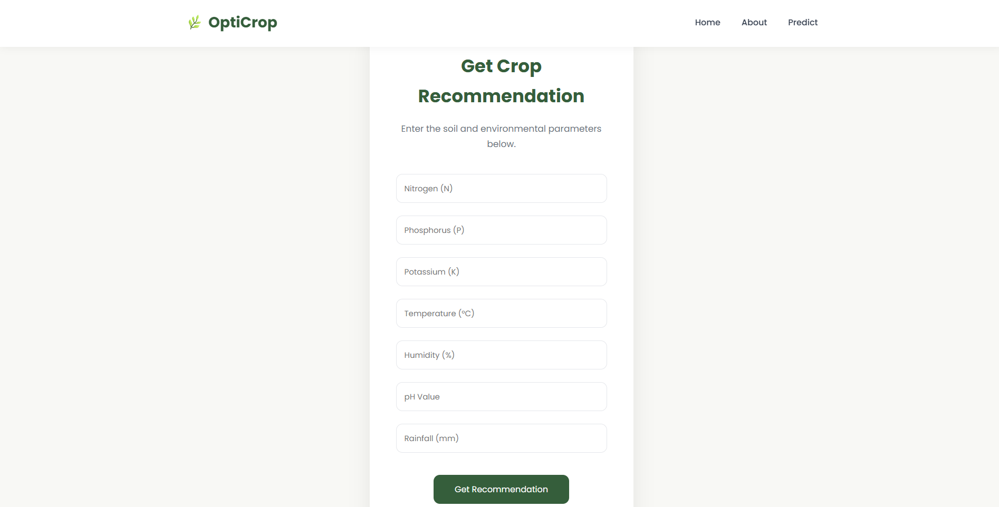
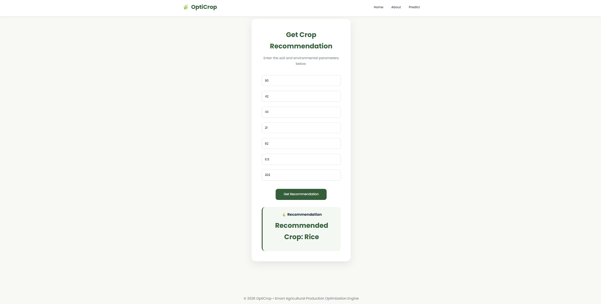

# 🌱 OptiCrop - Smart Agricultural Production Optimization Engine

## 📌 Project Overview

OptiCrop is a Machine Learning based crop recommendation system that predicts the most suitable crop based on soil nutrients and environmental conditions such as Nitrogen (N), Phosphorus (P), Potassium (K), temperature, humidity, pH, and rainfall.

The project covers the complete machine learning pipeline including:

- Data Collection
- Exploratory Data Analysis (EDA)
- Data Preprocessing
- Machine Learning Model Building
- Model Evaluation
- Crop Recommendation Prediction
- Flask Web Application

---

## 🛠 Technologies Used

- Python
- Pandas
- NumPy
- Matplotlib
- Seaborn
- Scikit-learn
- Flask
- HTML
- CSS
- JavaScript

---

## 📂 Project Structure

```text
OptiCrop/
│
├── TRAINING/
├── dataset/
├── flask/
├── screenshots/
├── README.md
└── requirements.txt
```

---

## 🤖 Machine Learning Model

- K-Means Clustering
- Logistic Regression

---

## 📊 Model Evaluation

The model was evaluated using:

- Accuracy
- Precision
- Recall
- F1-Score
- Classification Report

The trained model is saved as:

- model.pkl
- scaler.pkl

---

## 🌾 Crop Prediction

Users can enter:

- Nitrogen
- Phosphorus
- Potassium
- Temperature
- Humidity
- pH
- Rainfall

The application predicts the most suitable crop.

---

## 🚀 Installation

Clone the repository

```bash
git clone <repository-link>
```

Install dependencies

```bash
pip install -r requirements.txt
```

Run the application

```bash
cd flask
python app.py
```

## Open in Browser

https://opticrop-smart-agricultural-production-jmgm.onrender.com/

---

## 📸 Screenshots

### 🏠 Home Page


### ℹ️ About Page


### 🌱 Prediction Page


### ✅ Crop Recommendation Result


---

## 👩‍💻 Developed By

- Charishma Kongara
- Divya Sree Sai Pagadala
- Homarugvedha Chappidi
- Harshitha Kuruba
